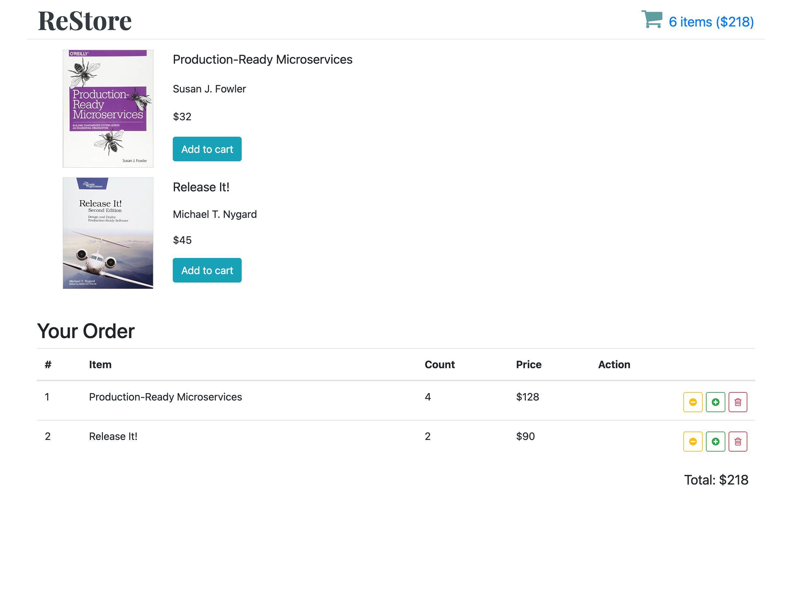

# [React-Bookstore]

<div align="center">

[](https://react.dev)
[](https://redux.js.org/)
[](https://reactrouter.com/)
[](https://github.com/reduxjs/redux-thunk)
[](https://create-react-app.dev/)
[](https://developer.mozilla.org/en-US/docs/Web/JavaScript)

</div>

## Overview

[A small React + Redux bookstore demo. Browse a list of books, add/remove items to a cart, and see totals update in real time. Built as a learning project to practice Redux patterns, async flows, and component composition.]

## Key Features

- [Book list with add-to-cart actions]
- [Shopping cart with increment/decrement/remove and total calculation]
- [Error boundary, loading spinner, and a simple service layer]

## Tech Stack

[React 16, Create React App 3, Redux, Redux Thunk, React Router 5, JavaScript (ES6)]

## Architecture

[CRA structure with `src/` entrypoint; routing via React Router v5; global state managed in Redux with Thunk for async; service access through a context + HOC (`bookstore-service-context`, `with-bookstore-service`).]

## Performance & Accessibility

[Lightweight bundle via CRA defaults; basic route-based splitting possible; semantic HTML and keyboard-accessible controls in core flows.]

## Quality

- Linting: [ESLint (react-app)] • Formatting: [N/A]
- Type safety: [JavaScript (no TypeScript)]
- Tests: [React Testing Library deps present; no committed tests]
- CI: [None]

## Prerequisites

- Node.js: `18.17.0`

## Installation

```bash
git clone https://github.com/maxgalchenko/React-Bookstore.git
cd React-Bookstore
npm install
```

## Quick Start

```bash
npm start
# Production
npm run build
npm run deploy
```

[Open http://localhost:3000]

## Available Scripts

- `npm start` – [Start the CRA dev server at http://localhost:3000]
- `npm run build` – [Bundle the app for production into `build/`]
- `npm test` – [Run tests in watch mode (no tests currently committed)]
- `npm run eject` – [Eject CRA configuration]
- `npm run deploy` – [Deploy the production build to GitHub Pages]
- `npm run predeploy` – [Build step executed before deploy]

## Screenshots



---

<div align="center">

Built with ❤️ by [Maksym Galchenko](https://github.com/maxgalchenko)

[](https://www.linkedin.com/in/galchenko-max/)
[](https://portfolio-green-six-29.vercel.app/)
[](mailto:galchenko.maksym@gmail.com)


</div>
